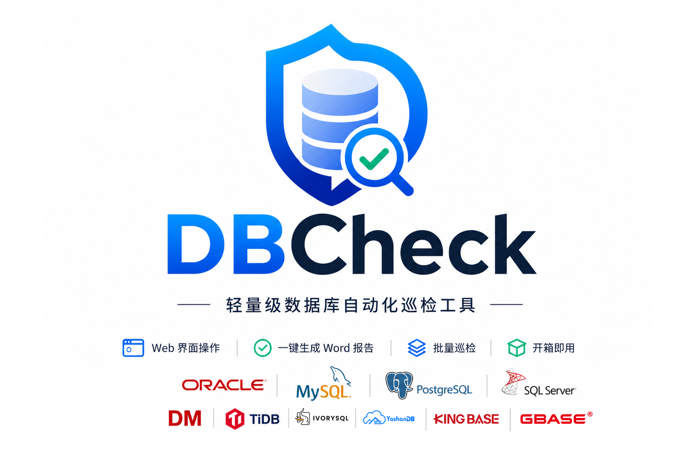

# DBCheck - Database Inspection Tool



DBCheck is an open-source, cross-platform automated database health check tool that supports eight mainstream relational databases: **MySQL**, **PostgreSQL**, **Oracle**, **SQL Server**, **DM8**, **TiDB**, **IvorySQL**, and **YashanDB**. The tool automatically generates standardized Microsoft Word inspection reports by executing predefined SQL checks and collecting system resources. It also provides advanced features such as SQL editor, remote terminal, configurable inspection chapters, configuration baseline management, historical trend analysis, AI-powered intelligent diagnostics, index health analysis, in-depth slow query analysis, server inspection, share links, and data-masked export. DBCheck aims to free DBAs from repetitive and time-consuming manual inspection work, improving database operation and maintenance efficiency and risk detection capabilities.
> website：https://dbcheck.top

> Language: [English](./README.md) | [中文](./README_zh.md)

[](https://dbcheck.top)
[]()
[]()
[]()
[]()
[]()
[]()
[]()
[]()
[]()
[]()
[]()

---

## 🌍 Multi-Language Support

DBCheck supports **Chinese (default)** and **English**. All interface text updates automatically when you switch languages.

### CLI Language Switch

```bash
python main.py                    # Default: Chinese
python main.py --lang en         # Switch to English
python main.py --lang zh         # Switch to Chinese (explicit)
```

> The Web UI also has a 🌐 toggle button in the top-right corner. Clicking it switches between Chinese and English. The setting is automatically saved and will be loaded on the next Web UI startup.

### Language Reference

| Parameter | Language | Notes |
|-----------|----------|-------|
| `--lang zh` | Chinese | Default language |
| `--lang en` | English | English interface |
| (not specified) | Chinese | Uses the last saved language; falls back to Chinese if no record exists |

> **Note**: The `--lang` parameter only takes effect for the current session and does not overwrite any saved language setting. Switching language in the Web UI persists to `dbc_config.json` and loads automatically on the next startup.

### Manually Modify Default Language

To change the default language without using CLI flags or Web UI, edit the configuration file directly:

```json
// dbc_config.json
{
    "language": "zh"   // "zh" = Chinese, "en" = English
}
```

The config file is located in the same directory as `main.py`.

## 🌓 Theme Switching

DBCheck Web UI supports both **dark** and **light** themes. Click the ☀️/🌙 button in the top bar to toggle instantly — the preference is saved to your browser and restored automatically on next visit.

| Feature | Description |
|---------|-------------|
| Default Theme | Dark (GitHub-style color palette) |
| Light Theme | High-contrast light variant for bright environments |
| Persistence | Stored in browser `localStorage`, survives page refresh |
| Zero Config | No CLI flags or config file changes needed |

## AI-Assisted - Detect and Resolve Issues

### AI-Powered Intelligent Diagnosis

Leveraging a fully offline, local **Ollama** deployment, DBCheck analyzes inspection metrics (connection counts, cache hit ratios, slow queries, security risks, etc.) and automatically generates structured optimization recommendations. AI insights are rendered as a dedicated chapter in the report — Markdown content is automatically styled into Word format (bold, code blocks, lists, numbered headings), ready to share with your team or leadership.

| Backend | Characteristics | Use Case |
|---------|----------------|----------|
| `ollama` | Local-only, zero cost, no network dependency | Air-gapped environments, high data-security requirements |
| `openai` | Cloud API (OpenAI / DeepSeek compatible), requires network and API Key | Environments that allow cloud API access |
| `disabled` | AI disabled (default) | Offline environments / AI not required |

> **Online Model Toggle**: In the Web UI **AI Settings** page, enable the "Online Model" checkbox to unlock cloud backends (OpenAI, DeepSeek, etc.). When disabled (default), only local Ollama is available — inspection data never leaves your machine.
>
> **Security Notice**: AI diagnosis is strictly limited to local Ollama (localhost:11434) when online mode is off. When online mode is enabled, data will be sent to the configured cloud API — ensure your API provider's privacy policy meets your requirements.

### Risk Detection and Recommendations

Each risk is presented as a card: **Risk Level (High/Medium/Low) → Issue Description → Remediation SQL (copy-paste ready) → Priority & Owner**. The report automatically aggregates all findings so you can see every pending item at a glance.

---

## Seven Core Capabilities

| Capability | Description |
|-----------|-------------|
| 🗄️ Centralized Datasource Management | Unified management of all database instances with grouping, batch inspection, connection testing, and CSV import/export |
| 📊 Historical Trend Analysis | Automatically aggregates data from multiple inspection runs on the same database, generates metric trend line charts, and compares against previous results to surface changes |
| 🤖 AI-Powered Diagnosis | Calls local Ollama based on inspection metrics to generate personalized optimization recommendations |
| 🔍 160+ Enhanced Rules | Full-dimensional risk detection across eight databases (MySQL 35+, PG 27+, Oracle 20+, SQL Server 15+, DM8 16+, TiDB 18+, IvorySQL 27+, YashanDB 15+) — including 28 new slow query deep analysis rules |
| 🖥️ Server Inspection | Comprehensive check of server hardware and system resource status, generating professional server inspection reports |
| 🔗 Share Links | Generate online share links with one click, supporting both server and database inspection report sharing |
| 📡 Real-Time Monitoring | Real-time slow query and active connection monitoring across all datasources with auto-refresh, heatmaps, and CSV export |

---

## SQL Editor

> Built-in interactive SQL editor — write, execute, and debug SQL queries directly in the Web UI without switching tools.

| Feature | Description |
|---------|-------------|
| Multi-Database Support | MySQL / PostgreSQL / Oracle / SQL Server / DM8 / TiDB / IvorySQL / YashanDB |
| Syntax Highlighting | Color-coded SQL statements for better readability |
| Result Grid | Query results displayed in a scrollable table with row numbers |
| Execution History | Recent queries are preserved within the current session |
| Error Feedback | Database errors are translated into friendly, actionable prompts |

---

## Real-Time Monitoring 📡

> DBCheck provides real-time monitoring for slow queries and active connections across all your datasources — no agents needed. Monitor runs in the browser via periodic polling and visualizes data with professional dashboards.

### Real-Time Slow Query Monitoring

| Feature | Description |
|---------|-------------|
| Multi-Datasource Aggregation | Automatically aggregates Top SQL from all configured datasources, displayed in a unified table |
| Smart Time Formatting | Execution times formatted contextually: milliseconds for sub-second, seconds for moderate, minutes for heavy queries |
| DB Type Identification | Automatically detects database type from datasource name and displays color-coded tags (MySQL=blue, PG=purple, TiDB=orange, Oracle=red, DM8=green) |
| Severity Indicators | Visual severity dots — 🔴 High (>60s), 🟡 Medium (>10s), 🟢 Low — for at-a-glance risk assessment |
| Sorting & Filtering | Sort by average time, max time, total time, or execution count; filter by datasource, time range, or SQL keywords |
| CSV Export | One-click export of current slow query data to CSV file with UTF-8 BOM encoding |
| Auto-Refresh | Configurable polling interval (5–60 seconds) with live countdown indicator and manual start/stop controls |

### Active Connection Monitoring

| Feature | Description |
|---------|-------------|
| Connection Usage Bars | Visual bar chart showing current connections vs. maximum for each datasource, color-coded by usage percentage (green <50%, yellow 50-80%, red >80%) |
| 12-Hour Heatmap | Historical connection usage heatmap aggregated by hour, with 5-level color coding for quick pattern recognition |
| Active Session Table | Real-time TOP 10 active sessions with user, state, duration, and SQL preview — filterable by datasource |
| Blocking Detection | Overview card highlights blocked sessions with affected datasource names |
| Idle Connection Tracking | Monitors longest idle connections with duration in minutes |
| Auto-Refresh | Shared polling engine with slow query monitor — one start/stop controls both pages |

### How to Use

1. Navigate to **📡 实时监控** in the Web UI sidebar
2. Click **▶ 启动** (Start) on the page header to begin monitoring
3. Set the polling interval (5–60 seconds) using the number input next to the start/stop buttons
4. Use filters to drill down by datasource, time range, or SQL keywords
5. Click **⏹ 停止** (Stop) to pause monitoring; data remains visible until next page refresh

---

## Remote Terminal

> SSH-based remote terminal built into Web UI — manage database servers directly from your browser.

| Feature | Description |
|---------|-------------|
| SSH Connection | Password and key-based authentication supported |
| Tab Management | Multiple terminal sessions in separate tabs |
| Full-Screen Mode | Expand to full screen for extended command-line work |
| Session Persistence | Terminal state preserved during page navigation |

---

## Inspection Config Management

> Flexible inspection chapter management — freely customize inspection scope per database type without modifying code. The inspection engine is now config-driven: chapters are automatically generated based on the active configuration, replacing the previous hardcoded approach.

| Feature | Description |
|---------|-------------|
| Chapter Management | Add, remove, reorder, or enable/disable inspection chapters per database type |
| Visual Toggle | Enable/disable individual inspection items with one click |
| Config Persistence | Saved to configuration file, survives restarts |
| Dynamic Report Generation | Word report chapters are generated from the active config — only enabled items appear in the report |

---

## Baseline Config Management

> Visual baseline configuration management through the Web UI — customize recommended values, thresholds, and compliance rules for each database type.

Complements the **Configuration Baseline Checks** feature described below. In addition to the built-in baselines, you can now:

| Feature | Description |
|---------|-------------|
| Edit Thresholds | Adjust recommended values and warning/critical thresholds via Web UI |
| Add Custom Rules | Define new baseline parameters beyond the built-in set |
| Per-Database Overrides | Apply different baselines for different instances or environments |
| Visual Management | All changes through the Web UI — no code edits required |

---

## Server Inspection 🖥️

> Comprehensive server health check covering CPU, memory, disk, network, services, and other critical metrics, generating professional server inspection reports.

### Overview

The server inspection feature operates independently from database inspections, focusing on server hardware and system resource health checks:

- **CPU Monitoring**: Usage rate, core count, frequency, load balancing
- **Memory Analysis**: Total, used, available, usage rate, Swap status
- **Disk Check**: Mount point capacity, usage rate, I/O performance
- **Network Monitoring**: Network interface status, traffic statistics, connection count
- **Service Status**: Critical service running status detection
- **Process Analysis**: Top process resource usage ranking

### Web UI Operation

On the **🖥️ Server Inspection** page in Web UI:

| Feature | Description |
|---------|-------------|
| One-Click Inspection | Select target server, execute comprehensive inspection with one click |
| Real-Time Progress | SSE push inspection progress, view detection results in real-time |
| Report Preview | Online preview of server status report after inspection completion |
| History Records | View historical server inspection report list |
| Share Links | Generate online share links for team collaboration |

### Report Content

Server inspection report includes the following chapters:

| Chapter | Content |
|---------|---------|
| Basic Information | Server name, IP address, operating system, uptime |
| CPU Status | Usage rate, core count, frequency, load status |
| Memory Status | Total, used, available, Swap usage |
| Disk Status | Partition capacity, usage rate, I/O performance metrics |
| Network Status | Network interfaces, traffic statistics, connection count |
| Service Status | Critical service running status |
| Process Analysis | Top process resource usage ranking |
| Overall Score | Comprehensive health score based on all metrics |

---

## Share Link Feature 🔗

> Generate online share links with one click, view inspection reports without login, supporting both server and database inspection report sharing.

### Features

| Feature | Description |
|---------|-------------|
| Online Viewing | View complete reports directly in browser via link |
| Permission Isolation | Share links can only view current report, no access to other pages |
| Access Statistics | Automatically record link visit count |
| Delete Anytime | Support deleting shared links, immediately invalid |
| Bilingual Support | Share page automatically adapts to Chinese/English interface |

### Use Cases

- **Team Collaboration**: Share inspection reports with team members without file transfer
- **Leadership Reporting**: Generate links for leadership review without software installation
- **Problem Discussion**: Open links directly in meetings to discuss inspection findings
- **Archive Memo**: Save links as historical records, accessible anytime

### Web UI Operation

#### Share Report

1. In **📋 Inspection History** or **🖥️ Server Inspection History** page
2. Click the **🔗 Share** button corresponding to the report
3. System automatically generates share link
4. Copy link and send to people who need to view

#### Manage Share Links

On the **🔗 Share Management** page:

| Feature | Description |
|---------|-------------|
| View List | Display all shared links, including title, type, visit count |
| Copy Link | One-click copy share link to clipboard |
| Delete Link | Delete share link, link immediately invalid |
| Access Statistics | View visit count for each link |

### Share Link Format

```
http://localhost:5003/share/{share_id}
```

- `share_id`: 12-character unique identifier, auto-generated
- Link accessible without login
- Can only view shared report, cannot access other feature pages

### API Endpoints

| Endpoint | Method | Description |
|----------|--------|-------------|
| `/api/server_inspect_share` | POST | Create server inspection share link |
| `/api/db_inspect_share` | POST | Create database inspection share link |
| `/share/<share_id>` | GET | View share report (standalone page) |
| `/api/share/<share_id>` | GET | Get share data |
| `/api/share/<share_id>` | DELETE | Delete share link |
| `/api/shares` | GET | Get all share list |

---

## Seven Ways to Use DBCheck

| Method | Description |
|--------|-------------|
| 🖥️ Command-Line | `python main.py` — terminal interaction, ideal for CLI-familiar users |
| 🌐 Web UI | `python web_ui.py` — browser-based GUI with trend charts and AI configuration |
| 💬 AI Chat Inspection | Open the AI panel in the bottom-right corner of Web UI, use natural language to start inspection, zero manual steps |
| 🤖 OpenClaw Skill | Tell your AI assistant "inspect the Oracle Database" — fully automated |
| 📦 Packaged Distribution | PyInstaller bundles everything into a single executable for team distribution |
| 🔗 Share Links | Generate online share links with one click, view inspection reports without login |

---

## Features

### Database Inspection

> Comprehensive inspection for eight mainstream relational databases, covering 160+ enhanced rules.

| Dimension | MySQL | PostgreSQL | Oracle | SQL Server | DM8 | TiDB | IvorySQL | YashanDB |
|-----------|:-----:|:----------:|:------:|:-----------:|:---:|:----:|:----:|
| Basic Info (version / instance / database) | ✅ | ✅ | ✅ | ✅ | ✅ | ✅ | ✅ |
| Session and Connection Status | ✅ | ✅ | ✅ | ✅ | ✅ | ✅ | ✅ |
| Memory and Cache Configuration | ✅ | ✅ | ✅ | ✅ | ✅ | ✅ | ✅ |
| Tablespace Usage | — | — | ✅ | ✅ | ✅ | — |— |
| SGA / PGA Memory Analysis | — | — | ✅ | — | ✅ | — |— |
| Redo Log Status | — | — | ✅ | — | ✅ | — |— |
| Archiving and Backup Checks | — | — | ✅ | ✅ | ✅ | — |— |
| Key Parameter Configuration | ✅ | ✅ | ✅ | ✅ | ✅ | ✅ | ✅ |
| Invalid Object Detection | ✅ | ✅ | ✅ | ✅ | ✅ | ✅ | ✅ |
| User Security Audit | ✅ | ✅ | ✅ | ✅ | ✅ | ✅ | ✅ |
| Top SQL / Slow Queries | ✅ | ✅ | ✅ | ✅ | ✅ | ✅ | ✅ |
| Master-Slave Replication / Data Guard | ✅ | ✅ | — | — | — | ✅ | ✅ |
| RAC Cluster Information | — | — | ✅ | — | — | — | — |
| ASM Disk Groups | — | — | ✅ | — | — | — | — |
| Undo Tablespace Management | — | — | ✅ | — | ✅ | — | — |
| Recycle Bin / Flashback Recovery Area | — | — | ✅ | — | ✅ | — | — |
| Profile Password Policy | — | — | ✅ | — | — | — | — |
| Top Wait Events | — | — | ✅ | ✅ | ✅ | — | — |
| Locks and Blocking Detection | ✅ | ✅ | ✅ | ✅ | ✅ | ✅ | ✅ |
| Stale Statistics Detection | — | — | ✅ | ✅ | ✅ | ✅ | ✅ |
| Partitioned Table Information | — | — | ✅ | ✅ | ✅ | ✅ | — |
| Datafile Status | — | — | ✅ | ✅ | ✅ | — | — |
| DM8 Buffer Pool Details | — | — | — | — | ✅ | — | — |
| Placement & Affinity Policy | — | — | — | — | — | ✅ | — |

> **IvorySQL**: PG-compatible, reuses PG inspection engine. All checkmarks are identical to PostgreSQL. Default port: 5432. Dependencies: `psycopg2-binary` (same as PG).
>
> **YashanDB**: Oracle-compatible, reuses Oracle inspection engine with YashanDB adaptations. Default port: 9088. Dependencies: `yashandb`.

### Server Inspection

> Comprehensive check of server hardware and system resource status, generating professional server inspection reports.

| Inspection Dimension | Description |
|---------------------|-------------|
| CPU | Usage rate, core count, frequency, load status |
| Memory | Total, used, available, usage rate, Swap status |
| Disk | Mount point capacity, usage rate, I/O performance |
| Network | Network interface status, traffic statistics, connection count |
| Services | Critical service running status detection |
| Processes | Top process resource usage ranking |
| Overall Score | Comprehensive health score based on all metrics |

### Share Links

> Generate online share links with one click, supporting both server and database inspection report sharing.

| Feature | Description |
|---------|-------------|
| Online Viewing | View complete reports directly in browser via link |
| Permission Isolation | Share links can only view current report, no access to other pages |
| Access Statistics | Automatically record link visit count |
| Delete Anytime | Support deleting shared links, immediately invalid |

### Datasource Management 🗄️

> Unified management of all database instances with grouping, batch inspection, and connection testing — significantly improving operational efficiency.

#### Core Features

| Feature | Description |
|---------|-------------|
| Multi-Database Support | MySQL / PostgreSQL / Oracle / SQL Server / DM8 / TiDB / IvorySQL / YashanDB |
| Instance Info | Customizable labels, groups, ports, usernames |
| Oracle-Specific | Service Name/SID configuration, SYSDBA privileged connection |
| Connection Testing | One-click database connection test with real-time results |
| Group Management | Organize by business/environment with custom color tags |
| CSV Import/Export | Batch import/export datasource configurations |

#### Web UI Datasource Management

| Feature | Description |
|---------|-------------|
| Add Datasource | Select database type → fill connection info → save |
| Edit Datasource | Modify any field, password optional update |
| Delete Datasource | With confirmation dialog to prevent accidental deletion |
| Connection Test | Test saved datasources with real-time results |
| Group Filtering | Filter by group to quickly locate target instances |
| Batch Import | Import datasources from CSV file |
| Batch Export | Export all datasources to CSV with one click |

#### Group Management

| Feature | Description |
|---------|-------------|
| Create Group | Custom name and color support |
| Edit Group | Modify name and color |
| Delete Group | Non-default groups can be deleted |
| Color Tags | Each group can have different colors for easy identification |

### Configuration Baseline Checks

> Automatically compares current configuration values against recommended baselines based on database size, memory, and workload — helping identify misconfigurations before they cause problems.

#### MySQL (22 parameters)

| Parameter | Description | Recommended Value Basis |
|-----------|-------------|------------------------|
| innodb_buffer_pool_size | InnoDB buffer pool size | 60–80% of total memory |
| max_connections | Maximum connections | 1.5× historical peak usage |
| tmp_table_size / max_heap_table_size | Temp & memory table size | 64MB; should match each other |
| innodb_log_file_size | Redo log file size | 256MB–1GB based on DB size |
| innodb_log_buffer_size | Log buffer size | 16MB |
| sync_binlog | Binlog sync frequency | 1 for high-write workloads |
| innodb_flush_log_at_trx_commit | Transaction log flush policy | 1 (strictest, safest) |
| table_open_cache / table_definition_cache | Table & definition cache | 2× table count / threads |
| thread_cache_size | Thread cache size | 50+ or 2–4× CPU cores |
| innodb_thread_concurrency | InnoDB concurrency | 2× CPU cores |
| innodb_io_capacity / io_capacity_max | I/O capacity (SSD/HDD) | 20000 / 200 |
| max_allowed_packet | Max packet size | 16MB–64MB |
| wait_timeout / interactive_timeout | Connection idle timeout | 300–600 seconds |
| sort_buffer_size / join_buffer_size | Sort & join buffer | 2–4MB / 1–2MB |
| long_query_time | Slow query threshold | 1–2 seconds |

#### PostgreSQL (21 parameters)

| Parameter | Description | Recommended Value Basis |
|-----------|-------------|------------------------|
| shared_buffers | Shared buffer size | 25% of total memory |
| effective_cache_size | Effective cache size | 75% of total memory |
| maintenance_work_mem | Maintenance memory | 256MB–1GB |
| work_mem | Work memory | (total_mem × 0.25) / max_connections |
| max_connections | Maximum connections | 200–1000 |
| temp_buffers / wal_buffers | Temp & WAL buffers | 8MB / 16MB |
| checkpoint_completion_target | Checkpoint completion target | 0.9 |
| max_wal_size / min_wal_size | WAL size bounds | 2GB / 256MB |
| random_page_cost | Random page cost | 1.1 (SSD) / 4.0 (HDD) |
| effective_io_concurrency | I/O concurrency | 200 (SSD) |
| shared_preload_libraries | Preloaded libraries | Should include pg_stat_statements |
| track_activities / track_counts | Statistics tracking | on |
| track_io_timing / track_functions | I/O & function tracking | on / pl |
| autovacuum | Auto vacuum | on |
| log_min_duration_statement | Slow query threshold | 1000–3000ms |

#### Oracle (12 parameters)

| Parameter | Description | Recommended Value Basis |
|-----------|-------------|------------------------|
| memory_target | Memory target (SGA+PGA) | 85% of physical memory |
| sga_target / pga_aggregate_target | SGA / PGA targets | 60% / 25% of total memory |
| processes | Maximum processes | 150 or CPU cores × 50 |
| open_cursors / session_cached_cursors | Cursor settings | 300–500 / 50 |
| log_buffer | Log buffer size | 8–64MB |
| undo_retention | Undo retention time | 3600 seconds |
| fast_start_mttr_target | MTTR target | 300 seconds |
| db_file_multiblock_read_count | Multiblock read count | 128 |
| statistics_level | Statistics level | TYPICAL |
| control_file_record_keep_time | Control file record retention | 7 days |

#### SQL Server (6 parameters)

| Parameter | Description | Recommended Value Basis |
|-----------|-------------|------------------------|
| max server memory (MB) | Max server memory | 85% of physical memory |
| cost threshold for parallelism | Parallelism cost threshold | 25–50 |
| max degree of parallelism | Max DOP | CPU cores / 2 |
| fill factor (%) | Fill factor | 80–90% |
| recovery interval (min) | Recovery interval | 60 minutes |
| backup compression default | Backup compression | 1 (enabled) |

#### DM8 (7 parameters)

| Parameter | Description | Recommended Value Basis |
|-----------|-------------|------------------------|
| MEMORY_TARGET | Memory target | 85% of physical memory |
| SGA_TARGET / PGA_TARGET | SGA / PGA targets | 60% / 25% of total memory |
| MAX_SESSIONS / OPEN_CURSORS | Session & cursor limits | 1000 / 500 |
| UNDO_RETENTION | Undo retention time | 3600 seconds |
| BUFFER | Buffer pool size | 30% of DB size |

#### TiDB (9 parameters)

| Parameter | Description | Recommended Value Basis |
|-----------|-------------|------------------------|
| innodb_buffer_pool_size | InnoDB buffer pool size | 70% of total memory |
| max_connections | Maximum connections | 3000 |
| tmp_table_size / max_heap_table_size | Temp & memory table size | 256MB; should match |
| innodb_log_file_size / innodb_log_buffer_size | Log file & buffer | 256MB / 64MB |
| max_allowed_packet | Max packet size | 64MB |
| tidb_hash_join_concurrency / tidb_index_lookup_concurrency | Operator concurrency | 5 each |

#### YashanDB (8 parameters)

| Parameter | Description | Recommended Value Basis |
|-----------|-------------|------------------------|
| BUFFER_POOL_SIZE | Buffer pool size | 30% of DB size |
| MAX_CONNECTIONS | Maximum connections | 500 |
| SORT_BUF_SIZE | Sort buffer size | 64MB |
| HASH_AREA_SIZE | Hash area size | 128MB |
| OPTIMIZER_MODE | Optimizer mode | ALL_ROWS |
| LOG_BUF_SIZE | Log buffer size | 8MB |
| ARCHIVE_LOG_MODE | Archive log mode | ENABLED |
| COMPATIBLE_MODE | Compatibility mode | ORACLE |

### Index Health Analysis

> Detects three types of index issues across all supported databases — missing indexes, redundant/duplicate indexes, and long-unused indexes — then generates actionable remediation recommendations.

#### MySQL

| Analysis Type | Data Source | Description |
|---------------|-------------|-------------|
| Missing indexes | performance_schema.events_statements_summary_by_digest + table_statistics | Identifies high-scan queries and tables lacking primary keys |
| Redundant indexes | information_schema.STATISTICS | Finds duplicate indexes on the same column(s) |
| Unused indexes | performance_schema.table_statistics | Detects indexes with zero read/write activity |

#### PostgreSQL

| Analysis Type | Data Source | Description |
|---------------|-------------|-------------|
| Missing indexes | pg_stat_statements | Identifies high-row-scan queries needing indexes |
| Redundant indexes | pg_indexes (indexdef parsing) | Finds identical or left-prefix-matching index pairs |
| Unused indexes | pg_stat_user_indexes (idx_scan=0) | Detects never-scanned indexes |

#### Oracle

| Analysis Type | Data Source | Description |
|---------------|-------------|-------------|
| Unused indexes | v$object_usage (MONITORING USAGE) | Detects indexes that have never been used |
| Redundant indexes | dba_ind_columns | Finds same-column-at-position-1 index pairs |

#### SQL Server

| Analysis Type | Data Source | Description |
|---------------|-------------|-------------|
| Unused indexes | sys.dm_db_index_usage_stats | Detects indexes with zero user_seeks + user_scans |
| Redundant indexes | sys.indexes + sys.index_columns | Finds same-leading-column index pairs |

#### DM8

| Analysis Type | Data Source | Description |
|---------------|-------------|-------------|
| Redundant indexes | USER_IND_COLUMNS | Finds identical or containing column index pairs |

#### TiDB

| Analysis Type | Data Source | Description |
|---------------|-------------|-------------|
| Redundant indexes | information_schema.STATISTICS | Finds identical or left-prefix-matching index pairs |

#### YashanDB

| Analysis Type | Data Source | Description |
|---------------|-------------|-------------|
| Redundant indexes | DBA_IND_COLUMNS | Finds identical or containing column index pairs |

### System Resource Monitoring

- **CPU**: utilization, core count, clock speed
- **Memory**: total, used, available, utilization rate
- **Disk**: capacity and utilization per mount point
- **Collection**: local collection or SSH remote collection (password/key auth supported, default port 22); Dameng DM8 supports SSH collection with automatic fallback to local collector on failure

### Intelligent Risk Analysis

Automatically detects potential database risks — **each risk includes an executable remediation SQL with one-click fix support**:

#### One-Click Fix 🔧

> No more copying and pasting SQL manually — execute remediation scripts directly from the Web UI.

| Feature | Description |
|---------|-------------|
| One-Click Execution | Each risk in the inspection report has an "Execute Fix" button — click to run directly |
| Dangerous SQL Confirmation | High-risk operations (DELETE, DROP, TRUNCATE) prompt for confirmation before execution |
| Multi-Database Support | MySQL / PostgreSQL / Oracle / SQL Server / DM8 / TiDB / IvorySQL / YashanDB |
| Execution Logging | All fix operations are logged for audit and traceability |
| User-Friendly Error Messages | Common database errors are translated into friendly Chinese prompts |

Execution Flow:
```
Risk Detected → View Fix SQL → Click "Execute Fix" → Dangerous ops require confirmation → Execute → View Results
```

#### MySQL (18+ rules)

| Dimension | Example Rules |
|-----------|--------------|
| Connections | Usage >90% = critical / >80% = warning |
| Memory | InnoDB buffer pool too small (< 60% of data size) |
| Disk | Usage >85% = warning / >95% = critical |
| Queries | Long-running SQL (>60s), slow query log disabled |
| Locks | High lock wait ratio |
| Security | Empty password users, root@% exposure, non-UTF8 charset |
| Replication | Master-slave lag >30s, replication errors |
| Other | binlog disabled, query cache remnants, excessive aborted connections |

#### PostgreSQL (16+ rules)

| Dimension | Example Rules |
|-----------|--------------|
| Connections | Near limit, too many superusers |
| Cache | Low hit ratio (<80%), undersized shared_buffers |
| Performance | Large accumulation of dead tuples, long-running SQL |
| Security | Overly permissive public schema permissions |
| Archiving | Archiving mode disabled |
| Other | Disk / memory / CPU resource alerts |

#### Oracle (20+ rules)

| Dimension | Example Rules |
|-----------|--------------|
| Tablespace | Usage >90% (including autoextend calculation) |
| TEMP | Temp tablespace usage too high |
| Sessions | Near limit / process overflow / lock blocking |
| Memory | SGA too large relative to physical memory |
| Redo | Redo log group issues / frequent switches |
| Backup | Archiving disabled / missing RMAN backups |
| DG | MRP not running / protection mode too low |
| ASM | Disk group space insufficient / offline disks |
| FRA | Flashback Recovery Area usage too high |
| Objects | Too many invalid objects / stale statistics |
| Security | Permissive Profile password policy / auditing disabled |
| Other | open_cursors too small / recycle bin bloat / datafiles offline |

#### DM8 (16+ rules)

| Dimension | Example Rules |
|-----------|--------------|
| Tablespace | Usage >90% (including autoextend calculation) |
| Memory | Pool misconfigurations (KEEP/RECYCLE/FAST/NORMAL/ROLL) |
| Sessions | Near connection limit / long-running sessions |
| Transactions | Blocking transaction detection / waits |
| Backup | Missing backup sets / backup timeouts |
| Parameters | Key parameters (INSTANCE_MODE, COMPATIBLE_VERSION, etc.) |
| Security | Empty passwords / overly broad permissions / auditing disabled |
| Objects | Invalid objects / stale statistics / partitioned table info |
| Archiving | Archiving disabled / log accumulation |

#### SQL Server (15+ rules)

| Dimension | Example Rules |
|-----------|--------------|
| Connections | Current connections near maximum limit |
| Sessions | Active sessions anomalies / long-running sessions |
| Waits | Wait statistics TOP10 / wait type analysis |
| Locks | Current lock info / lock waits and blocking chains |
| Deadlocks | Deadlock history detection / blocking process analysis |
| Backups | Recent backup missing / backup type check |
| Database | Database status / recovery model / file sizes |
| Memory | Memory clerk usage / buffer pool hit ratio |
| Performance | Top SQL sorted by CPU / IO / execution time |

#### TiDB (18+ rules)

| Dimension | Example Rules |
|-----------|--------------|
| Connections | Usage >90% = critical / >80% = warning |
| Memory | TiDB memory configuration anomalies |
| Disk | Usage >85% = warning / >95% = critical |
| Queries | Long-running SQL (>60s), slow query log disabled |
| Locks | Lock wait events / deadlock detection |
| Security | Empty password users, root@% exposure, non-UTF8 charset |
| Replication | TiCDC/PD heartbeat anomalies / follower lag |
| Placement | Placement rules misconfiguration / affinity policy |
| Stats | Stale statistics / auto-analyze disabled |
| Other | binlog disabled, excessive aborted connections, system CPU/memory pressure |

### 🔒 P0 Lock Diagnostics (v2.4.4)

> Deep lock analysis with structured reporting — blocking chain visualization, deadlock statistics, long-transaction detection, and actionable fix scripts — now available across all six database engines.

#### Diagnostic Dimensions

| Chapter | Focus | Key Metrics |
|---------|-------|-------------|
| **4.1 Lock Blocking Chain** | Identify the root blocker in multi-level wait chains | Blocker SID / lock type / locked object name. Severity tier: ≥60s (critical), 10–60s (warning), <10s (info). `fix_sql` uses correct SERIAL# for precise session termination |
| **4.2 Deadlock Statistics** | Cumulative deadlock counts and trace analysis | Aggregates `v$sysstat` deadlock counter, top-10 current wait sessions, trace file analysis guide |
| **4.3 Long Transaction Detection** | Detect transactions exceeding 60s threshold | Undo block consumption, ORA-01555 risk assessment, termination script with rollback estimate |

#### Per-Database Coverage

| Database | SQL Templates Added | Lock Analysis Dimensions | Causal Templates |
|----------|:-------------------:|--------------------------|:----------------:|
| **MySQL** | +4 (InnoDB lock chain / deadlock / long trx / lock type stats) | 5-dimension (blocker, blocked, lock type, duration, object) | 6 |
| **PostgreSQL** | +4 (blocking chain / deadlock / long trx / lock type distribution) | 5-dimension (blocking PID, blocked PID, lock mode, duration, relation) | 5 |
| **Oracle** | +3 (blocking sessions via v$lock×v$session join / deadlock stats / long trx) | 5-dimension (SID, SERIAL#, lock type, object, seconds) | 5 |
| **DM8** | +3 (V$LOCK analysis / V$TRXWAIT chain / V$TRX long trx) | 5-dimension (TRX_ID, LTYPE, LMODE, BLOCKED, duration) | 5 |
| **SQL Server** | Built-in (sys.dm_exec_requests blocking_chain / deadlock_xml / long-running sessions) | 5-dimension | 4 |
| **TiDB** | Built-in (CLUSTER_PROCESSLIST / DEADLOCKS / TIDB_TRX) | 5-dimension | 4 |
| **IvorySQL** | +4 (PG-compatible, reuses PG lock analysis logic) | 5-dimension (same as PostgreSQL) | 5 |
| **YashanDB** | +3 (V$LOCK analysis / V$TRXWAIT chain / V$TRX long trx) | 5-dimension (same as Oracle) | 5 |

> **Note**: SQL Server and TiDB lock diagnostics are natively integrated through system DMVs / cluster tables and do not require additional SQL templates. All eight engines output structured lock analysis chapters in the Word report.

### Historical Trend Analysis

> Run multiple inspections on the same database, and DBCheck automatically aggregates the data to generate trend charts — spotting gradual changes before they become incidents.

- After each inspection, key metrics (memory utilization, connections, QPS, CPU, etc.) are written to a local **SQLite database** (`db_history.db`), surviving process restarts
- Data is aggregated per database (IP + port + type), retaining up to 30 historical snapshots per instance
- SQLite storage is wrapped by `SQLiteHistoryManager`; the original `HistoryManager` API is fully preserved — no migration needed for existing code
- Graceful degradation: if SQLite is unavailable (permissions, locking), the system automatically falls back to in-memory mode without blocking inspections
- The Web UI provides a **trend analysis page** with line charts and threshold lines
- Side-by-side comparison with the previous run: changes shown with colored arrows (↑ deteriorating / ↓ improving)

### AI-Powered Diagnosis

> Leveraging inspection data, DBCheck calls a local Ollama LLM to generate personalized optimization recommendations — evolving from "problem detection" to "problem resolution".

Comparison of Intelligent Analysis vs. AI Diagnosis:

| | Intelligent Analysis | AI Diagnosis |
|---|---|---|
| Principle | Fixed rules, deterministic offline judgment | Local LLM inference, personalized output |
| Speed | Milliseconds | Depends on model response time |
| Output | Deterministic conclusions + remediation SQL | Natural language recommendations, Markdown auto-rendered to Word |
| Invocation | Runs automatically on every inspection | On-demand (can be disabled) |

**AI Backend Configuration (Web UI Settings):**

| Parameter | Description |
|-----------|-------------|
| Online Model | Checkbox — enable to use cloud APIs (OpenAI / DeepSeek); disabled by default |
| Backend Type | `ollama`, `openai`, or `disabled` |
| API Address | Ollama: `http://localhost:11434`; OpenAI: `https://api.openai.com/v1` |
| API Key | Required for `openai` backend (OpenAI / DeepSeek key) |
| Model Name | e.g. `qwen3:30b` (Ollama), `gpt-4o-mini` (OpenAI), `deepseek-chat` (DeepSeek) |
| Timeout | Default 600 seconds (LLM cold start can be slow) |

> ⚠️ When online mode is off, any non-localhost API address is automatically rejected to prevent data leakage.

## AI Chat Inspection 💬

DBCheck supports natural language interaction — start an inspection without manual steps.

Open the **AI Assistant panel** in the bottom-right corner and type:

```
inspect MySQL-primary
run full inspection on Oracle
check PostgreSQL lock waits
```

The system will automatically:

- Parse intent and match the datasource
- Kick off the inspection task with a clean animated progress indicator
- Push the Word report download link when complete

<p align="center">
  
</p>

---

### Slow Query Deep Analysis 🔍

> Beyond basic slow query detection, DBCheck performs multi-dimensional deep analysis — correlating execution plans, I/O patterns, lock waits, and temporary table usage — then feeds the results directly into AI diagnostics for intelligent root cause analysis.

#### What It Does

When a database exhibits slow query symptoms, DBCheck collects the Top N worst-performing queries across multiple performance dimensions, performs automated risk rule analysis, and then invokes the AI advisor to generate targeted optimization recommendations.

#### Data Collection Dimensions

Each database has its own optimized query for capturing the most expensive statements:

| Database | Data Source | Collection Dimensions |
|----------|-------------|------------------------|
| **MySQL** | `performance_schema.events_statements_summary_by_digest` | Execution latency, full table scans, lock waits, temporary tables, sort operations |
| **PostgreSQL** | `pg_stat_statements` | Total time, avg time, I/O time, temp blocks, current long-running queries |
| **Oracle** | `v$sql` | Buffer Gets, Disk Reads, Elapsed Time |
| **SQL Server** | `sys.dm_exec_query_stats` | CPU usage, logical reads, elapsed time, physical reads |
| **DM8** | `V$SQL` | Execution time, disk reads |
| **TiDB** | `information_schema.cluster_slow_query` | Query time, memory usage, scan rows, Coprocessor tasks |
| **YashanDB** | `V$SQL` | Execution time, disk reads |

#### Integration with Inspection Flow

```
checkdb() execution order:
1. getData() → SQL inspection queries
2. checkdb() → Intelligent risk analysis
3. Slow Query Deep Analysis ← NEW (auto-executed after AI diagnosis)
4. context['slow_query_result'] → smart_analyze_* for risk rule evaluation
5. AI Advisor → injects slow_query_top3 + slow_query_count metrics
```

The `SlowQueryResult` container standardizes the output from all database analyzers, ensuring consistent downstream processing regardless of database type.

#### Enhanced Risk Rules

The inspection engine adds database-specific slow query rules:

**MySQL (new rules 17+):**
- `performance_schema` not enabled
- Full table scan detection
- Lock wait ratio threshold
- AI diagnosis injection of slow query findings

**PostgreSQL (new rules 11+):**
- `pg_stat_statements` extension not enabled
- High-latency query detection
- High I/O query detection
- Long-running query threshold
- AI diagnosis injection of slow query findings

#### AI Diagnosis Enhancement

A dedicated `build_slow_query_ai_prompt()` function generates a targeted diagnostic prompt. The AI advisor receives:

- **slow_query_top3**: The three most impactful slow queries (by latency, I/O, or execution frequency)
- **slow_query_count**: Total number of slow queries captured

This enables the AI to provide precise, query-level optimization advice rather than generic recommendations.

#### Output in Report

Slow query analysis results appear in the report's risk chapter, tagged with severity levels (🔴 High / 🟡 Medium / 🟢 Low) and paired with actionable remediation SQL.

---

## Scheduled Inspection & Auto-Notification ⏰📧🔔

> Configure recurring inspection tasks with cron expressions — DBCheck runs automatically and sends reports to your team via email or Webhook the moment each run completes.

### Scheduling

The Web UI provides a dedicated **⏰ Scheduled Inspection** page:

| Feature | Description |
|---------|-------------|
| Cron Expression | Configurable second/minute/hour/day/month/weekday schedule |
| Quick Presets | Daily (2 AM), Weekdays (9 AM), Weekly (Monday 9 AM), Monthly (1st 3 AM) |
| Per-Task Notification Toggle | Each task independently controls whether to send a notification on completion |
| One-Click Run | Trigger any scheduled task immediately without waiting for the next run |
| Persistent Jobs | Task configs saved to `scheduler_jobs.json` — survive restarts |

### Notifications

The Web UI provides a dedicated **📧🔔 Notification Settings** page:

#### Email Report (SMTP)

| Feature | Description |
|---------|-------------|
| SMTP Server | Supports 126, 163, QQ, corporate mail, and other SMTP services |
| Port | 465 (SSL implicit) or 587 (TLS explicit) |
| TLS | Auto-detected by port; configurable |
| Recipients | Multiple comma-separated addresses |
| Trigger | Automatically sent after every successful scheduled inspection |
| Attachment | Word inspection report attached directly |

#### Webhook Alert

| Feature | Description |
|---------|-------------|
| Types | Enterprise WeChat (markdown), DingTalk (markdown + @), Custom JSON |
| Trigger | Sent after every scheduled inspection — both success and failure |
| Failure Alert | Includes error message; report file included on success |
| Custom Payload | Template variables: `{label}`, `{db_type}`, `{status}`, `{error}`, `{report_file}` |

#### Environment Variable Override

Sensitive credentials can be loaded from environment variables instead of the config file:

| Variable | Description |
|----------|-------------|
| `SMTP_HOST` | SMTP server address |
| `SMTP_PORT` | SMTP port |
| `SMTP_USER` | Username / email |
| `SMTP_PASSWORD` | Password or authorization code |
| `SMTP_USE_TLS` | Enable TLS (`true`/`false`) |
| `SMTP_FROM_NAME` | Display name in From field |
| `WEBHOOK_URL` | Webhook URL |
| `WEBHOOK_TYPE` | `wecom` / `dingtalk` / `custom` |

> Environment variables take precedence over values in `notifier_config.json`, enabling secure deployments without storing credentials in config files.

---

## RAG Knowledge Base 📚

> Upload your database documentation and operational manuals — DBCheck automatically vectorizes the content and retrieves relevant knowledge during AI diagnostics to generate more accurate optimization recommendations.

### Overview

The RAG Knowledge Base enables AI-powered diagnostics to reference your own documentation:

- **Upload documents**: Support for PDF, Word (.docx), Markdown (.md), TXT, and HTML formats
- **Automatic chunking**: Intelligent semantic segmentation with configurable chunk size and overlap
- **Vector storage**: SQLite-based vector store, queries run locally
- **Ollama integration**: Uses `nomic-embed-text` for embedding generation
- **AI-enhanced diagnosis**: During AI diagnostics, automatically retrieves relevant knowledge base content and injects it into the prompt

### Supported Document Formats

| Format | Extension | Notes |
|--------|-----------|-------|
| PDF | `.pdf` | PyPDF2 based extraction |
| Word | `.docx` | python-docx based extraction |
| Markdown | `.md` | Plain text with structure preserved |
| Text | `.txt` | Plain text |
| HTML | `.html` / `.htm` | BeautifulSoup based extraction |

### How It Works

```
Document Upload → Semantic Chunking → Ollama Embedding → Vector Storage
                                    ↓
        AI Diagnosis ← Knowledge Retrieval ← Top-K Similarity Search
```

### Web UI Integration

The **📚 RAG Knowledge Base** page in Web UI provides:

- **Ollama Status Detection**: Shows connection status on page load
- **Document Upload**: Select file + database type + title → automatic chunking and vectorization
- **Document List**: Displays uploaded documents with title, database type, file size, chunk count, and status
- **Document Deletion**: One-click delete with toast confirmation dialog

### API Endpoints

| Endpoint | Method | Description |
|----------|--------|-------------|
| `/api/rag/documents` | GET | List all uploaded documents |
| `/api/rag/documents` | POST | Upload and vectorize a document |
| `/api/rag/documents/<doc_id>` | DELETE | Delete a document |
| `/api/rag/ollama-status` | GET | Check Ollama connection status |

### Getting Started

1. **Pull Ollama Embedding Model**
   ```bash
   ollama pull nomic-embed-text
   ```

2. **Start Ollama** (if not already running)
   ```bash
   ollama serve
   ```

3. **Open Web UI** → Navigate to **📚 RAG Knowledge Base**
   ```bash
   python web_ui.py
   ```

4. **Upload Documents**: Select your database documentation (Oracle Admin Guide, MySQL Reference Manual, etc.) and select the appropriate database type

5. **Run AI Diagnosis**: The system automatically retrieves relevant knowledge base content during diagnostics

### Ollama Models Required

| Model | Purpose | Command |
|-------|---------|---------|
| `nomic-embed-text` | Document embedding | `ollama pull nomic-embed-text` |
| `qwen3:30b` (or similar) | AI diagnosis LLM | `ollama pull qwen3:30b` |

---

## Oracle AWR Report Analysis 📊

> Upload an Oracle AWR HTML report (generated by awrrpt.sql) — DBCheck automatically parses the report content, extracts key performance metrics, generates a structured Word analysis report, and supports AI-powered diagnosis.

### Overview

The AWR report analysis feature eliminates the need for DBAs to manually read lengthy AWR HTML reports:

- **Smart Parsing**: Automatically extracts metadata (database name, instance name, version, RAC status) and all chapter data from AWR HTML reports
- **Metadata Extraction**: Identifies snap range, database version, instance information, and RAC cluster status
- **Word Report Generation**: Renders AWR data into a professionally formatted Word document with cover page, chapter data tables, and analysis summaries
- **AI Diagnosis**: When enabled, extracts key metrics (load, efficiency, cache, I/O) to build a diagnostic summary and generates optimization recommendations via AI
- **Markdown Rendering**: AI output in Markdown is automatically rendered to Word styles (bold, code blocks, lists, numbered headings)
- **Progress Indicator**: Step-by-step progress display (Parse AWR → AI Diagnosis → Generate Report) to avoid waiting uncertainty

### Report Chapters

The AWR analysis report dynamically includes the following chapters based on the original AWR content:

| Chapter | Content |
|---------|---------|
| Metadata Summary | Database name, instance name, version, RAC status, Snap time range |
| Load Profile | Per-second / per-transaction load metrics |
| Instance Efficiency | Cache hit ratio, library cache hit ratio, and other efficiency metrics |
| Top Wait Events | Top wait events sorted by wait time |
| SQL Statistics | Top SQL by executions / elapsed time / logical reads |
| Tablespace I/O | Read/write statistics per tablespace |
| Shared Pool & Library Cache | Shared pool memory usage, library cache hit ratio |
| Latch Statistics | Top latch contention analysis |
| Buffer Pool Advisor | Buffer pool sizing recommendations |
| AI Diagnosis | AI optimization recommendations based on AWR key metrics (optional) |

### How to Use

1. Navigate to **📊 AWR Report Analysis** in the Web UI sidebar
2. Click or drag-and-drop the AWR HTML file into the upload area
3. Review the parsing results (metadata + chapter summary)
4. Click "📝 Generate Analysis Report" to download the Word document

---

## Environment Requirements

- **Operating System**: Linux / macOS / Windows
- **Python**: 3.10+
- **General Dependencies**: pymysql, psycopg2-binary, python-docx, docxtpl, paramiko, psutil, openpyxl, pandas, flask, flask_socketio, apscheduler
- **Oracle Dependencies**: `oracledb` (recommended, pure Python, no Instant Client needed) or `cx_Oracle` (requires Oracle Instant Client)
- **DM8 Dependencies**: `dmpython` (pip install dmpython)
- **SQL Server Dependencies**: `pyodbc` + ODBC Driver 17 (supported on Windows and Linux)
- **MySQL Privileges**: Read-only access to information_schema, performance_schema, and mysql databases
- **PostgreSQL Privileges**: Read-only access to pg_stat_* series views and pg_roles
- **Oracle Privileges**: Read-only access to v$* and dba_* views; SYSDBA privileged connections supported (Web UI checkbox for one-click enablement)
- **SQL Server Privileges**: Read-only access to sys.databases, sys.master_files, and sys.dm_* dynamic management views
- **DM8 Privileges**: Read-only access to V$* system views and DBA_* admin views; default port 5236; connecting user equals Schema (no `database` parameter needed)
- **TiDB Dependencies**: `pymysql` (same as MySQL — TiDB uses the MySQL protocol; default port **4000**)
- **TiDB Privileges**: Read-only access to information_schema, performance_schema, and mysql databases (identical to MySQL)
- **IvorySQL Dependencies**: `psycopg2-binary` (same as PostgreSQL — IvorySQL is PG-compatible; default port **5432**)
- **IvorySQL Privileges**: Read-only access to pg_stat_* series views and pg_roles (identical to PostgreSQL)
- **YashanDB Dependencies**: `yashandb` (pip install yashandb)
- **YashanDB Privileges**: Read-only access to V$* system views (Oracle-compatible; default port **9088**)

### Installing Dependencies

```bash
pip install -r requirements.txt
```

> 💡 **Database Driver Notes:**
>
> - **Oracle**: `oracledb` (recommended, pure Python, no Instant Client needed)
> - **DM8**: `dmpython` (Dameng official driver)
> - **SQL Server**: Requires [ODBC Driver 17](https://docs.microsoft.com/en-us/sql/connect/odbc/download-odbc-driver-for-sql-server) installed separately

> DM8 Driver Notes:
> - `dmpython`: Pure Python driver provided by Dameng (pip install dmpython), recommended
> - Connection parameters: host + port (default 5236) + username (no `database` parameter — the user is the Schema)
> - DM8's V$ view column names differ significantly from Oracle; the tool includes targeted adaptations for DM8

> Oracle Driver Notes:
> - `oracledb`: Pure Python implementation, no Instant Client required, recommended
> - `cx_Oracle`: Requires downloading [Oracle Instant Client](https://www.oracle.com/database/technologies/instant-client.html) and configuring environment variables

---

## Quick Start

### Web UI

Start the web service and visit **http://localhost:5003** in your browser to perform all inspections via the GUI.

```bash
python web_ui.py
```

> 🔐 **Default credentials**: Username `dbcheck`, Password `dbcheck`. Change your password in the Account Center after first login.

**Web UI Workflow:**

| Step | Function |
|:---:|---------|
| 1 | 🗄️ Datasource Management: Add, edit, delete, test database connections with group management |
| 2 | Select database type (🐬 MySQL / 🐘 PostgreSQL / 🔴 Oracle / 🟠 SQL Server / 🟡 DM8 / 🐬 TiDB / 🐘 IvorySQL / 🔵 YashanDB) |
| 3 | Fill in connection info — Oracle requires service name/SID; DM8 does not need a database name |
| 4 | Online connection testing (SYSDBA privileged verification via checkbox) |
| 5 | Configure SSH for system resource collection (optional, default port 22; DM8 supports SSH with auto-fallback) |
| 6 | Inspector name (default: dbcheck), optionally check "🔒 Desensitize Report" to mask sensitive info |
| 7 | Confirm and execute with one click — real-time log streaming (SSE) |
| 8 | Upon completion, preview intelligent analysis + AI diagnosis results online |
| 9 | 📊 History & Trends | View trend charts and historical inspection reports |
| 10 | ⏰ Scheduled Inspection | Configure cron-based recurring inspections |
| 11 | 📧🔔 Notification Settings | Email and Webhook alerting configuration |
| 12 | 📚 RAG Knowledge Base | Upload and manage database documentation for AI-enhanced diagnostics |
| 13 | 🖥️ Server Inspection | Comprehensive check of server hardware and system resource status |
| 14 | 🔗 Share Management | Manage shared report links, support viewing, copying, and deletion |


```bash
python main.py
```

The main menu offers nine options:

```
python main.py --lang en             

  ██████╗ ██████╗  ██████╗██╗  ██╗███████╗ ██████╗██╗  ██╗
  ██╔══██╗██╔══██╗██╔════╝██║  ██║██╔════╝██╔════╝██║ ██╔╝
  ██║  ██║██████╔╝██║     ███████║██║     ██║     █████╔╝
  ██║  ██║██╔══██╗██║     ██╔══██║██╔══╝  ██║     ██╔═██╗
  ██████╔╝██████╔╝╚██████╗██║  ██║███████╗╚██████╗██║  ██╗
  ╚═════╝ ╚═════╝  ╚═════╝╚═╝  ╚═╝╚══════╝ ╚═════╝╚═╝  ╚═╝
          🗄️  Database Automation Inspector  v2.4.5  Main Menu
  ──────────────────────────────────────────────────────────
    🐬  1 │ MySQL（5.6/5.7/8.0+）
    🐘  2 │ PostgreSQL（10+）
    🔴  3 │ Oracle（12c+）
    🟠  4 │ SQL Server (2012+)
    🟡  5 │ DM8 (DM8+)
    🐬  6 │ TiDB (6.5+ / MySQL 8.0+ compatible)
    🐘  7 │ IvorySQL (PG-compatible)
    🔵  8 │ YashanDB (2.0+ / Oracle-compatible)
  ──────────────────────────────────────────────────────────
    📋  8 │ Batch Template Generator
    🌐  9 │ Launch Web UI
    ❌  0 │ Exit
```

#### Single Instance Inspection (Oracle as Example)

1. Select **3** to enter the Oracle inspection menu
2. Select **1** for single-instance inspection
3. Fill in as prompted:
   - Inspection name
   - Database IP / port (default 1521) / service name or SID
   - Username (SYSDBA supported — Web UI checkbox, CLI accepts `sys as sysdba` syntax) / password
   - SSH info (optional, default port 22, used for system resource collection)
4. The tool runs 42 SQL checks → collects system info → runs intelligent risk analysis → AI diagnosis (optional)
5. A Word inspection report is generated

#### Batch Inspection

1. Generate the corresponding Excel batch inspection template via option **4**
2. Fill in connection information for multiple database instances in the template
3. Select **2** for batch inspection — the program automatically runs through all instances


### OpenClaw Skill

DBCheck is published as an OpenClaw Skill on [ClawHub](https://clawhub.ai/skills/dbcheck). Once installed in your AI assistant, you can trigger inspections via natural language — no CLI or Web UI needed.

#### Installation

Run in your OpenClaw client:

```bash
clawhub install dbcheck
```

#### Usage

After installation, simply tell your AI assistant what you need, for example:

> "Inspect the Oracle Database at IP localhost, username sys as sysdba"

The AI assistant will load the Skill, ask for missing information step by step (port, service name, inspector name, etc.), then invoke the inspection script to generate a Word report.

#### Supported Commands

| Example Command | Description |
|---------------|-------------|
| Help me inspect a MySQL Database | Single-instance MySQL inspection |
| Help me inspect a PostgreSQL Database | Single-instance PG inspection |
| Help me inspect an Oracle Database | Single-instance Oracle inspection |
| Inspect Oracle at localhost | Quick inspection targeting a specific IP |
| Generate a database inspection report | Trigger the full inspection workflow |

#### Skill File Structure

```
dbcheck/skill/dbcheck/
├── SKILL.md               # Skill documentation
├── security.md            # Security notes
└── scripts/
    ├── run_inspection.py       # Non-interactive entry point
    ├── main_mysql.py           # MySQL inspection logic
    ├── main_pg.py              # PostgreSQL inspection logic
    ├── main_oracle_full.py     # Oracle inspection logic (20+ checks)
    ├── main_sqlserver.py       # SQL Server inspection logic
    ├── main_dm.py              # Dameng DM8 inspection logic
    ├── main_tidb.py             # TiDB inspection logic
    ├── analyzer.py             # Intelligent risk analysis engine
    ├── slow_query_analyzer.py   # Slow query deep analysis engine (MySQL/PG/Oracle/SQLServer/DM8/YashanDB)
    └── main.py                 # Unified menu entry
```

> **Security Notice**: Skill credentials are used only to establish local connections and are never sent to any third party. AI diagnosis uses local Ollama exclusively.

---

## Packaging and Distribution

Use the PyInstaller configuration file `dbcheck.spec` to bundle everything into a single executable containing all dependencies, templates, and project modules:

```bash
cd D:\DBCheck

# Clean old build (Windows)
rd /s /q build dist __pycache__ 2>nul

# Package
pyinstaller dbcheck.spec
```

> On Linux/macOS, use `rm -rf build dist __pycache__` to clean.

Run the packaged version:

```bash
cd dist
dbcheck.exe         # Windows
./dbcheck           # Linux/macOS
```

Double-click to run the full-featured program with all database drivers, Word templates, and Web UI templates included — no Python environment installation required.

---

## Report Structure

The generated Word report contains the following chapters (Oracle inspection report example):

| Chapter | Content (Oracle Inspection) |
|---------|----------------------------|
| Cover | Database name, server address, version, hostname, uptime, inspector, platform, report timestamp |
| Chapter 1 | OS Host Information (CPU / Memory / Disk) |
| Chapter 2 | Database Basic Information (version / instance name / database name) |
| Chapter 3 | Tablespaces (permanent + temporary, including autoextend) |
| Chapter 4 | SGA / PGA Memory Analysis |
| Chapter 5 | Key Parameter Configuration |
| Chapter 6 | Undo Tablespace Management |
| Chapter 7 | Redo Logs |
| Chapter 8 | Archiving and Backup |
| Chapter 9 | Data Guard Status |
| Chapter 10 | RAC Cluster Information |
| Chapter 11 | ASM Disk Groups |
| Chapter 12 | Sessions and Connections (including Top 5 Wait Events) |
| Chapter 13 | Performance Metrics (including AWR snapshot analysis) |
| Chapter 14 | Alert Log Analysis |
| Chapter 15 | Users and Security |
| Chapter 16 | Invalid Objects and Statistics |
| Chapter 17 | Partitioned Table Information |
| Chapter 18 | FRA Flashback Recovery Area |
| Chapter 19 | Recycle Bin |
| Chapter 20 | Risks and Recommendations (intelligent analysis details + remediation SQL quick reference) |
| Chapter 21 | AI Diagnosis Recommendations (Markdown auto-rendered to Word with numbered headings, code blocks, lists) |
| Chapter 22 | Report Notes |

> Report structure varies slightly by database type, but all include the six core modules: cover, basic information, performance analysis, risk recommendations, AI diagnosis, and report notes.

---

## FAQ

### General

1. **Some content is empty or missing**
   When template rendering encounters compatibility issues, the program automatically switches to a fallback rendering mode and still produces a complete report with all key data — usage is unaffected.

2. **Connection failure**
   Verify that the database allows remote access, the user has sufficient privileges, and the firewall permits the relevant port.

3. **SSH collection failure**
   Confirm the SSH service is running (default port 22) and authentication credentials are correct. Some stripped-down Linux distributions lack commands like `lscpu`, causing CPU information to show "not obtained" — this is normal.

4. **AI diagnosis not working**
   - Confirm a valid configuration is saved in Web UI → AI Diagnosis Settings
   - Ensure Ollama is running: `ollama serve`
   - Ensure the model is downloaded: `ollama pull qwen3:30b` (larger models recommended; cold start is slow)

5. **Risk recommendations are for reference only**
   Built-in thresholds are based on general best practices. Evaluate them in the context of your actual workload.

### Oracle-Specific

6. **ORA-01017 invalid username/password**
   - For SYSDBA access: check the "SYSDBA" box in Web UI; in CLI, enter `sys as sysdba` (full format) — the tool automatically parses and uses the correct privileged mode
   - Verify the password is correct (case-sensitive)

7. **ORA-00904 / ORA-00942 invalid identifier**
   Some advanced views/columns may not exist in certain Oracle versions (e.g., 11g vs 19c). The tool handles compatibility gracefully; incompatible items are marked with ⚠️ and skipped without affecting the overall inspection.

8. **Do I need to install an Oracle client?**
   - Using `oracledb` driver (recommended): No — pure Python implementation
   - Using `cx_Oracle` driver: Yes — download [Oracle Instant Client](https://www.oracle.com/database/technologies/instant-client.html)

9. **Oracle version support**
   Supports **11g R2, 12c, 19c, 21c** and above. SQL templates are cross-version compatible.

### DM8-Specific

10. **Connection failure (returned a result with an exception set)**
    - dmPython uses lazy connections — a successful connection object creation does not mean the connection is actually established; a probe SQL must be executed via cursor to confirm
    - The tool includes built-in auto-probe logic. If it still fails, check: correct port (default 5236), correct user password, and whether the server allows access from your IP

11. **"Invalid column name" error**
    - DM8's V$ view column names differ significantly from Oracle; the tool has been adapted for DM8实测 column names. If errors persist, please send a screenshot so we can add support.

12. **SSH collection not available**
    - Limited by the Dameng server's OpenSSH version (port 2022), SSH collection is temporarily disabled. System resource information will use the local collector. Local and Dameng server information being inconsistent is expected.

13. **"Server hostname/platform" in the report shows local machine info**
    - A known limitation when SSH collection is disabled; Dameng server system info collection depends on the SSH channel and will be addressed in a future version.

### SQL Server-Specific

14. **Connection failure**
    - Confirm SQL Server allows remote connections (SQL Server Configuration Manager → Network Configuration → TCP/IP enabled)
    - Confirm firewall allows port 1433 (or custom port)
    - Confirm correct authentication mode (Windows Authentication or Mixed Mode)

15. **pyodbc installed but connection fails**
    - ODBC Driver 17 required: install via `curl https://packages.microsoft.com/keys/microsoft.asc | apt-key add -` then install mssql-server
    - On Linux: `curl https://packages.microsoft.com/config/ubuntu/$(lsb_release -rs)/prod.list | tee /etc/apt/sources.list.d/mssql-release.list`

16. **SQL Server version support**
    - Supports **SQL Server 2012, 2014, 2016, 2017, 2019, 2022** and above

---

## REST API (v2.4.3+)

DBCheck provides a REST API for external tools such as CI/CD pipelines and monitoring systems. API Key authentication is required — create keys in the **API Key Management** page in the Web UI.

```bash
# Health check
curl http://localhost:5003/api/v1/health

# Trigger inspection (sync)
curl -X POST http://localhost:5003/api/v1/inspect \
  -H "X-API-Key: YOUR_API_KEY" -H "Content-Type: application/json" \
  -d '{"db_type":"mysql","host":"192.168.1.100","port":3306,"user":"root","password":"****"}'

# Trigger inspection (async, returns task_id)
curl -X POST http://localhost:5003/api/v1/inspect \
  -H "X-API-Key: YOUR_API_KEY" -H "Content-Type: application/json" \
  -d '{"db_type":"oracle","host":"192.168.1.200","service_name":"ORCL","user":"system","password":"****","mode":"async"}'

# Query result
curl -H "X-API-Key: YOUR_API_KEY" http://localhost:5003/api/v1/inspect/{task_id}
```

### API Endpoints

| Method | Path | Description |
|--------|------|-------------|
| `GET` | `/api/v1/health` | Health check |
| `POST` | `/api/v1/inspect` | Trigger inspection |
| `GET` | `/api/v1/inspect/{task_id}` | Query task result |
| `GET` | `/api/v1/inspects` | List recent tasks |
| `POST` | `/api/server_inspect_share` | Create server inspection share link |
| `POST` | `/api/db_inspect_share` | Create database inspection share link |
| `GET` | `/share/<share_id>` | View share report (standalone page) |
| `GET` | `/api/share/<share_id>` | Get share data |
| `DELETE` | `/api/share/<share_id>` | Delete share link |
| `GET` | `/api/shares` | Get all share list |

### Parameters

| Parameter | Type | Required | Description |
|-----------|------|:---:|-------------|
| `db_type` | string | ✅ | mysql / pg / oracle / dm / sqlserver / tidb / ivorysql |
| `host` | string | ✅ | Database host |
| `port` | int | | Default per type |
| `user` | string | | Default per type |
| `password` | string | | Password |
| `service_name` | string | | Oracle service name |
| `database` | string | | PG/TiDB database name |
| `mode` | string | | sync (default) / async |
| `ssh` | object | | SSH tunnel `{host, port, user, password}` |

> **Security**: Use HTTPS reverse proxy (nginx) in production. Rotate API keys regularly.

---

## Screenshots


*Fig. 1: Select database type (MySQL 🐬 / PostgreSQL 🐘 / Oracle 🔴 / DM8 🟡)*


*Fig. 2: Fill in database connection information*


*Fig. 3: Online connection testing*


*Fig. 4: SSH configuration (optional, default port 22)*


*Fig. 5: Inspector name configuration (default: dbcheck)*


*Fig. 6: Confirm inspection information*


*Fig. 7: One-click inspection with real-time log streaming*


*Fig. 8: Download Word report directly after inspection*


*Fig. 9: Historical report list, browsable by name, size, and time*


*Fig. 10: Historical trend analysis*


*Fig. 11: AI diagnosis configuration — fully local, no API key needed, data never leaves your machine*


*Datasource Management*


*Rule Management*


*RAG Knowledge Base*


*Fig. 12: dbcheck published on ClawHub*


*Fig. 13: Using dbcheck in QClaw and other OpenClaw-compatible applications*


*Fig. 14: AI diagnosis report (Markdown auto-rendered to Word format)*


*Fig. 15: Server inspection report*


*Fig. 16: Share management page*


*Fig. 17: Share view page*
---

## Acknowledgments

>This project referred to the following projects, and we would like to thank the original project author for their efforts:

* [Zhh9126/MySQLDBCHECK](https://github.com/Zhh9126/MySQLDBCHECK.git)
* [Zhh9126/SQL-SERVER-CHECK](https://github.com/Zhh9126/SQL-SERVER-CHECK.git)

Some features are still undergoing rapid iteration, and more database types will be added in the future to enhance their own functionality. We welcome joint participation in feature development and feedback on issues and suggestions.

---

## Support the Project

DBCheck has undergone extensive iteration and real-world testing to reach its current state. If this tool has been helpful to you, consider supporting the project's continued development:


> When donating, please include your name or nickname so we know who supports us ❤️
> 
> website: https://dbcheck.top
> 
> Contact: sdfiyon@gmail.com

## Donor List

Thank you to everyone who has supported this project! ❤️

| Date | Name / Nickname |Serial number|
|------|-----------|-----|
| 2026-4-28 | *ck |No.000001|
| 2026-4-29 | *嵘 |No.000002|
| 2026-5-4 | **政 |No.000003|
| 2026-6-2 | **月光 | No.000004|
| 2026-6-3 | *树 |No.000005|
| 2026-6-7 | *0518 |No.000006|
| *Looking forward to your support!* | |

> If you've donated but don't see your name here, please contact us at sdfiyon@gmail.com to have it added.
