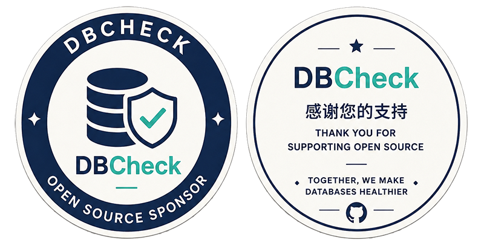

# DBCheck — Open-Source Intelligent Database Inspection Tool


DBCheck is an open-source, cross-platform database health inspection tool supporting **10 mainstream relational databases**. It automatically generates standardized Word inspection reports by executing predefined SQL checks and collecting system resources. Advanced features include a SQL editor, remote terminal, configurable inspection chapters, configuration baseline management, historical trend analysis, AI-powered smart diagnostics, index health analysis, in-depth slow query analysis, server inspection, shareable links, and masked data export.

> **Note:** The software names, logos, trademarks, badges, etc. of third parties contained in this article and DBCheck software are the property of the third-party companies or organizations. The display of these items in this article and DBCheck software only indicates that the software supports connection to the corresponding database or platform, and does not imply any affiliation or cooperation with them.

> Website: [https://dbcheck.top](https://dbcheck.top) &nbsp;|&nbsp; Email: sdfiyon@gmail.com
> 
> Language: [English](./README.md) | 语言：[中文](./README_zh.md)

[]()
[]()
[]()
[]()
[]()
[]()
[]()
[](https://dbcheck.top)
[](https://hub.docker.com/r/jackge12345/dbcheck)
[]()


---

## Supported Databases

| Database | Driver | Default Port | Notes |
|----------|--------|:---:|-------|
| MySQL | pymysql | 3306 | 5.6 / 5.7 / 8.0+ |
| PostgreSQL | psycopg2 | 5432 | 10+ |
| Oracle | oracledb (pure Python, no client needed) | 1521 | 11g R2 / 12c / 19c / 21c+ |
| SQL Server | pyodbc + ODBC Driver 17 | 1433 | 2012+ |
| DM8 (Dameng) | dmpython | 5236 | Chinese domestic DB |
| TiDB | pymysql (MySQL protocol) | 4000 | 6.5+ |
| IvorySQL | psycopg2 (PG protocol) | 5333 | PG + Oracle dual-compatible |
| YashanDB | yashandb | 1688 | Oracle-compatible, Chinese domestic DB |
| KingbaseES | psycopg2 (PG protocol) | 54321 | Chinese domestic DB |
| GBase 8s | JDBC (jaydebeapi + JDK) | 9088 | Chinese domestic DB |

---

## 🐳 Docker Quick Start (Recommended)

One command to get started — no dependencies required:

```bash
# Docker Hub
docker pull jackge12345/dbcheck:latest
docker run -d -p 5003:5003 \
  -v dbcheck_data:/app/data \
  -v dbcheck_reports:/app/reports \
  --name dbcheck \
  jackge12345/dbcheck:latest

# GitHub Container Registry (China-friendly)
docker pull ghcr.io/fiyo/dbcheck:latest
docker run -d -p 5003:5003 \
  -v dbcheck_data:/app/data \
  -v dbcheck_reports:/app/reports \
  --name dbcheck \
  ghcr.io/fiyo/dbcheck:latest
```

Visit **http://localhost:5003**. Default credentials are `admin` / `admin123` (change your password in Account Center after first login).

### docker-compose (Recommended)

```bash
curl -o docker-compose.yml https://raw.githubusercontent.com/fiyo/DBCheck/main/docker-compose.yml
docker compose up -d
```

> **GBase 8s Note**: The Docker image is pre-installed with JDK + JDBC driver. GBase data sources work out of the box — no extra configuration needed.

---

## Source Installation Quick Start

### Requirements

- Python 3.10+
- Database-specific Python drivers (see table above)

```bash
# Clone the repository
git clone https://github.com/fiyo/DBCheck.git
cd DBCheck

# Install dependencies
pip install -r requirements.txt

# Start Web UI
python web_ui.py
```

Visit **http://localhost:5003**.


### CLI Mode

```bash
python main.py           # Chinese interface (default)
python main.py --lang en # English interface
python web_ui.py         # Web interface
```

---

## Core Features at a Glance

| Feature | Description |
|---------|-------------|
| 🗄️ Data Source Manager | Unified management of all database instances, with grouping, batch inspection, CSV import/export |
| 📋 Database Inspection | 10 database types covered, 160+ enhanced rules, auto-generates Word reports |
| 🔍 Deep Slow Query Analysis | Correlates execution plans, I/O patterns, lock waits; AI-assisted root cause analysis |
| 🔒 Lock Diagnostics | Blocking chain visualization, deadlock stats, long transaction detection, with executable fix scripts |
| 📊 Index Health Analysis | Detects missing indexes, redundant indexes, long-unused indexes |
| ⚙️ Config Baseline Check | Compare current vs. recommended values for key parameters across all databases |
| 📈 Historical Trend Analysis | Aggregate multi-round inspection data, trend line charts, before/after change comparison |
| 🤖 AI Smart Diagnostics | Local Ollama-based, analyzes inspection metrics and generates optimization suggestions |
| 💬 AI Chat Inspection | AI panel (bottom-right in Web UI), natural language inspection workflow |
| 📡 Real-time Monitoring | Slow queries + active connections monitoring with heatmap visualization |
| 🖥️ Server Inspection | CPU / memory / disk / network / process comprehensive check |
| 🔗 Shareable Links | One-click shareable report links, viewable without login |
| ⏰ Scheduled Tasks | Cron-based periodic inspections, auto email/Webhook notification on completion |
| 📚 RAG Knowledge Base | Upload ops documentation; AI retrieves relevant knowledge during diagnostics |
| 📊 AWR Report Analysis | Upload Oracle AWR HTML reports; auto-generates structured Word analysis report |
| 📝 SQL Editor | Built-in Web UI SQL editor with syntax highlighting, result table, execution history |
| 🖥️ Remote Terminal | SSH-based, multi-tab, fullscreen mode |

---

## Database Inspection

### Inspection Coverage by Database

| Category | MySQL | PG | Oracle | SQL Server | DM8 | TiDB | IvorySQL | YashanDB | KingbaseES | GBase 8s |
|----------|:---:|:---:|:---:|:---:|:---:|:---:|:---:|:---:|:---:|:---:|
| Basic Info (version/instance/DB) | ✅ | ✅ | ✅ | ✅ | ✅ | ✅ | ✅ | ✅ | ✅ | ✅ |
| Sessions & Connections | ✅ | ✅ | ✅ | ✅ | ✅ | ✅ | ✅ | ✅ | ✅ | ✅ |
| Memory & Cache | ✅ | ✅ | ✅ | ✅ | ✅ | ✅ | ✅ | ✅ | ✅ | ✅ |
| Tablespaces | — | — | ✅ | ✅ | ✅ | — | — | ✅ | — | ✅ |
| SGA / PGA Memory | — | — | ✅ | — | ✅ | — | — | ✅ | — | — |
| Redo Logs | — | — | ✅ | — | ✅ | — | ✅ | — | — | — |
| Archive & Backup | — | — | ✅ | ✅ | ✅ | — | — | ✅ | — | — |
| Key Parameter Config | ✅ | ✅ | ✅ | ✅ | ✅ | ✅ | ✅ | ✅ | ✅ | ✅ |
| Invalid Objects | ✅ | ✅ | ✅ | ✅ | ✅ | ✅ | ✅ | ✅ | ✅ | ✅ |
| User Security Audit | ✅ | ✅ | ✅ | ✅ | ✅ | ✅ | ✅ | ✅ | ✅ | ✅ |
| Top SQL / Slow Queries | ✅ | ✅ | ✅ | ✅ | ✅ | ✅ | ✅ | ✅ | ✅ | ✅ |
| Replication / Data Guard | ✅ | ✅ | — | — | — | ✅ | ✅ | — | ✅ | — |
| RAC Cluster | — | — | ✅ | — | — | — | — | — | — | — |
| Lock & Blocking Detection | ✅ | ✅ | ✅ | ✅ | ✅ | ✅ | ✅ | ✅ | ✅ | ✅ |
| Object Statistics | — | — | ✅ | ✅ | ✅ | ✅ | ✅ | — | ✅ | ✅ |
| Partitioned Tables | — | — | ✅ | ✅ | ✅ | ✅ | ✅ | — | ✅ | — |
| Chunks / Disk Storage | — | — | — | — | — | — | — | — | — | ✅ |
| Logical Logs / Checkpoints | — | — | — | — | — | — | — | — | — | ✅ |

### Word Report Structure (Oracle Example)

| Chapter | Content |
|---------|---------|
| Cover | Database name, version, host info, inspector, timestamp |
| Ch. 1 | OS host info (CPU / memory / disk) |
| Ch. 2 | Database basic information |
| Ch. 3 | Tablespaces (with auto-extend info) |
| Ch. 4 | SGA / PGA memory analysis |
| Ch. 5 | Key parameter configuration |
| Ch. 6–19 | Undo / Redo / Archive / DG / RAC / ASM / Sessions / Performance / Security, etc. |
| Ch. 20 | Risks & Recommendations (with executable fix SQL) |
| Ch. 21 | AI Diagnostic Suggestions (Markdown rendered in Word) |
| Ch. 22 | Report Notes |

> Report structure varies slightly by database type; all chapters can be freely configured via the Web UI.

---

## Intelligent Risk Analysis

Automatically detects potential risks across all database types. **Each risk item includes executable fix SQL with one-click execution support.**

### Risk Rule Statistics

| Database | Rules | Coverage |
|----------|:---:|----------|
| MySQL | 35+ | Connections, memory, disk, slow queries, locks, security, replication |
| PostgreSQL | 27+ | Connections, cache, performance, security, archive, dead tuples |
| Oracle | 20+ | Tablespace, TEMP, sessions, SGA, Redo, DG, ASM, security |
| SQL Server | 15+ | Connections, sessions, waits, locks, deadlocks, backup, memory |
| DM8 | 16+ | Tablespace, memory pools, sessions, transactions, backup, security |
| TiDB | 18+ | Connections, memory, disk, slow queries, locks, security, placement |
| IvorySQL | 27+ | Same as PostgreSQL |
| YashanDB | 15+ | Connections, memory, tablespace, locks, backup, security |
| KingbaseES | 19+ | Connections, cache, performance, security, archive, stats |
| GBase 8s | 6+ | Connections, dbspace, logs, memory, password policies |

### One-Click Fix

Each risk card provides an "Execute Fix" button. Dangerous operations (DELETE / DROP / TRUNCATE) require secondary confirmation. All operations are logged.

---

## AI Smart Diagnostics

Based on local **Ollama** deployment — all inspection data stays offline, no internet required.

| Backend | Description | Use Case |
|---------|-------------|----------|
| `ollama` | Fully local, zero cost, data never leaves the machine | Intranet, high-security environments |
| `openai` | Cloud API (OpenAI / DeepSeek), requires internet | Environments allowing cloud APIs |
| `disabled` | Disable AI (default) | No AI functionality needed |

**Quick Start:**

```bash
ollama pull qwen3:30b          # Pull diagnostic model (larger = better)
ollama pull nomic-embed-text    # Pull RAG embedding model (required for knowledge base)
python web_ui.py                # Configure in AI Settings page after launching
```

---

## Other Features

### SQL Editor

Built-in interactive SQL editor in Web UI, supporting all 10 database types with syntax highlighting, result tables, and friendly error messages.

### Real-time Monitoring

Slow queries + active connections live monitoring with heatmap visualization, auto-refresh (5–60s adjustable), CSV export support.

### Remote Terminal

SSH-based, supports password/key authentication, multi-tab management, fullscreen mode.

### Server Inspection

Independent of database inspection. Covers CPU / memory / disk / network / services / processes, generating professional server inspection reports.

### Historical Trend Analysis

Multi-round inspection data is automatically aggregated. Web UI trend analysis page displays line charts with threshold lines. Before/after changes are highlighted with colored arrows.

### Scheduled Tasks & Notifications

Supports Cron expressions with quick presets (daily / weekdays / weekly / monthly). Auto-sends email (with Word report attachment) or Webhook (WeCom / DingTalk / custom JSON) notifications on completion.

### Shareable Links

One-click shareable links for reports, viewable without login. Permission isolation, automatic visit counting, instant deletion support.

### Configuration Baseline Management

Web UI visual editor for recommended values, thresholds, and compliance rules for key parameters across all databases. Currently supported:

- MySQL: 22 parameters (buffer pool, connections, binlog, etc.)
- PostgreSQL: 21 parameters (shared_buffers, work_mem, WAL, etc.)
- Oracle: 12 parameters (SGA/PGA, processes, undo, etc.)
- SQL Server: 6 parameters (memory, parallelism, backup compression, etc.)
- DM8: 7 parameters (memory target, sessions, buffer pool, etc.)
- TiDB: 9 parameters (buffer pool, connections, concurrency, etc.)
- YashanDB: 8 parameters (buffer pool, connections, logs, etc.)
- KingbaseES: 7 parameters (connections, buffers, vacuum, etc.)
- GBase 8s: 9 parameters (MAXCONNECTIONS, SHMVIRTSIZE, BUFFERS, LOGSMAX, etc.)

### Inspection Chapter Management

Configuration-driven — each database type can independently add/delete/reorder/enable/disable inspection chapters. Word reports are generated dynamically.

### AWR Report Analysis

Upload Oracle AWR HTML reports; automatically parse key performance metrics and generate structured Word analysis reports with AI-assisted diagnostics.

### RAG Knowledge Base

Upload PDF / Word / Markdown / TXT documents for automatic vectorization. AI retrieves relevant knowledge during diagnostics for more precise suggestions.

### Multi-Language & Themes

- Supports Chinese (default) and English; switchable via CLI argument and Web UI
- Dark / Light theme support with automatic preference saving

---

## REST API

API Key authentication, suitable for CI/CD and monitoring system integration.

```bash
# Health check
curl http://localhost:5003/api/v1/health

# Trigger inspection (synchronous)
curl -X POST http://localhost:5003/api/v1/inspect \
  -H "X-API-Key: YOUR_KEY" -H "Content-Type: application/json" \
  -d '{"db_type":"mysql","host":"192.168.1.100","port":3306,"user":"root","password":"****"}'

# Trigger inspection (async, returns task_id)
curl -X POST http://localhost:5003/api/v1/inspect \
  -H "X-API-Key: YOUR_KEY" -H "Content-Type: application/json" \
  -d '{"db_type":"oracle","host":"192.168.1.200","service_name":"ORCL","user":"system","password":"****","mode":"async"}'
```

| Endpoint | Method | Description |
|----------|--------|-------------|
| `/api/v1/health` | GET | Health check |
| `/api/v1/inspect` | POST | Trigger inspection |
| `/api/v1/inspect/{task_id}` | GET | Query task result |
| `/api/v1/inspects` | GET | Recent task list |
| `/share/<share_id>` | GET | View shared report |

> Production environments should use nginx as a reverse proxy and rotate API keys regularly.

---

## Distribution Packaging

Package as a single executable using PyInstaller:

```bash
# Windows
rd /s /q build dist __pycache__
pyinstaller dbcheck.spec
cd dist
dbcheck.exe

# Linux
pyinstaller build/dbcheck_linux.spec
cd dist
./dbcheck
```

---

## Environment Quick Reference

| Database | Python Driver | Extra Dependencies |
|----------|---------------|-------------------|
| MySQL / TiDB | pymysql | — |
| PostgreSQL / IvorySQL / KingbaseES | psycopg2-binary | — |
| Oracle | oracledb (recommended) | No Instant Client needed |
| SQL Server | pyodbc | ODBC Driver 17 |
| DM8 | dmpython | DM8 client libraries |
| YashanDB | yashandb | — |
| **GBase 8s** | **jaydebeapi + JPype1** | **JDK 8/11/17 + JDBC driver jar** |

---

## FAQ

**Q: Some sections appear empty or missing?**
A: The template auto-degrades with graceful fallback when rendering compatibility issues occur; critical data is never lost.

**Q: Connection failed?**
A: Verify remote access permissions, user privileges, and firewall port accessibility.

**Q: GBase 8s reports "Driver not found"?**
A: Ensure the JDBC driver jar is at `drivers/gbase/jdbc-3.5.1.jar` and JDK is installed. The Docker image includes both — no extra configuration needed.

**Q: AI diagnostics not working?**
A: Ensure Ollama is running (`ollama serve`) and the model is downloaded (`ollama pull qwen3:30b`).

**Q: Oracle ORA-01017 invalid username/password?**
A: For SYSDBA users, check the "SYSDBA" checkbox in Web UI, or enter `sys as sysdba` in CLI mode.

**Q: Risk recommendations are for reference only?**
A: Built-in thresholds are based on general best practices. Evaluate against your actual business requirements.

---

## Acknowledgements

This project references the following works:

- [Zhh9126/MySQLDBCHECK](https://github.com/Zhh9126/MySQLDBCHECK.git)
- [Zhh9126/SQL-SERVER-CHECK](https://github.com/Zhh9126/SQL-SERVER-CHECK.git)

## Support the Project

> ❤️ Thank you for supporting DBCheck.
>
> DBCheck is and will remain open source and free to use. Donations are entirely optional and help cover the time, infrastructure, and ongoing effort required to maintain and improve the project.
>
> If you find DBCheck useful, your support is appreciated. If not, that's completely okay too. A GitHub Star, bug report, feature suggestion, code contribution, or simply sharing the project with others is equally valuable.
>
> Thank you for being part of the DBCheck community.




> Please specify your name or nickname when sponsoring ❤️

### Sponsors

| Date | Name | ID |
|------|------|------|
| 2026-04-28 | \*ck | No.000001 |
| 2026-04-29 | \*嵘 | No.000002 |
| 2026-05-04 | \*\*政 | No.000003 |
| 2026-06-02 | \*\*月光 | No.000004 |
| 2026-06-03 | \*树 | No.000005 |
| 2026-06-07 | \*0518 | No.000006 |
| 2026-06-17 | \*轩 | No.000007 |
| 2026-06-18 | \*云 | No.000008 |
| 2026-06-18 | \*lnet | No.000009 |
| 2026-06-18 | \**威 | No.000010 |
| 2026-06-19 | \**良 | No.000011 |
| 2026-06-19 | \***予怀 | No.000012 |
---

> Author: [Jack Ge](https://github.com/fiyo) &nbsp;|&nbsp; Website: [https://dbcheck.top](https://dbcheck.top) &nbsp;|&nbsp; Email: sdfiyon@gmail.com
